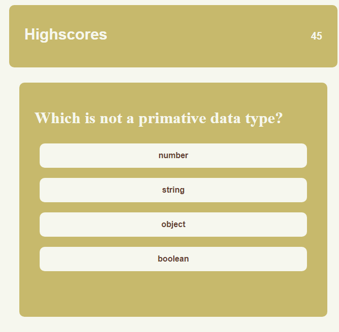

# Coding Test

## Description
This is a challenge of my skills in Javascript and my knowledge in APIs. This test is a short quiz on javascript and APIs utilizing the things I have learned in the past two weeks. 

This test has gone through some considerable work. Through debugging this web app, I have learned the .off() function.

## Usability

To play this quiz, click on the start button. A timer will appear along with the first question. If you answer incorrectly, ten seconds will be subtracted from the timer. Your final score will be how much time remains once you are complete. 

## Link

https://ruckusenjoyer.github.io/ch4-code-test/
